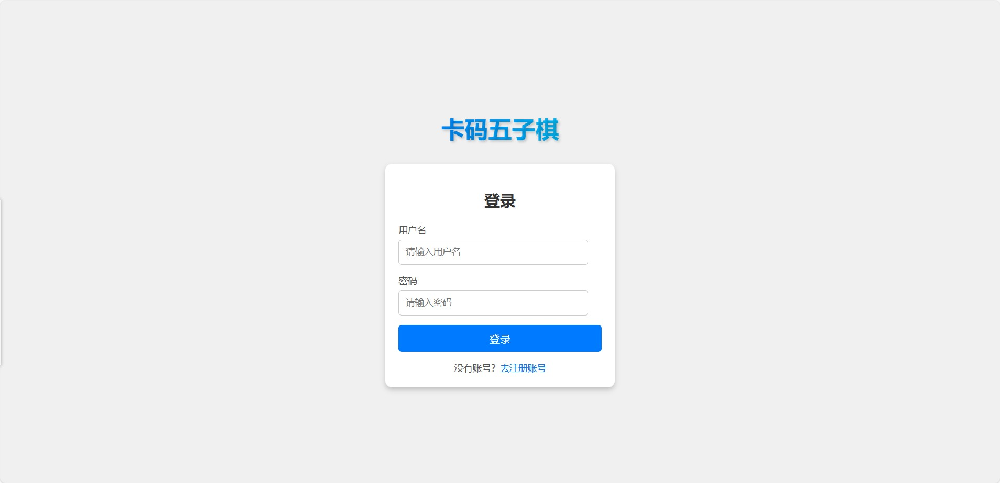
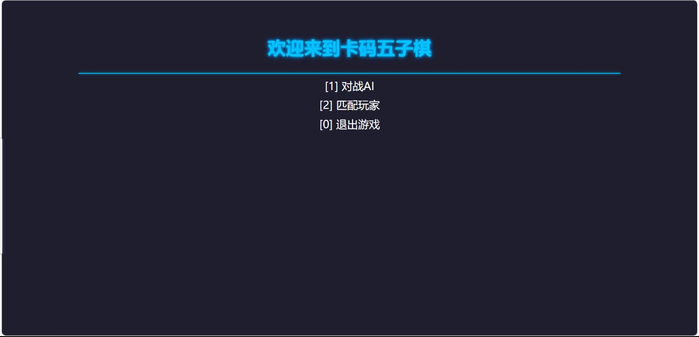
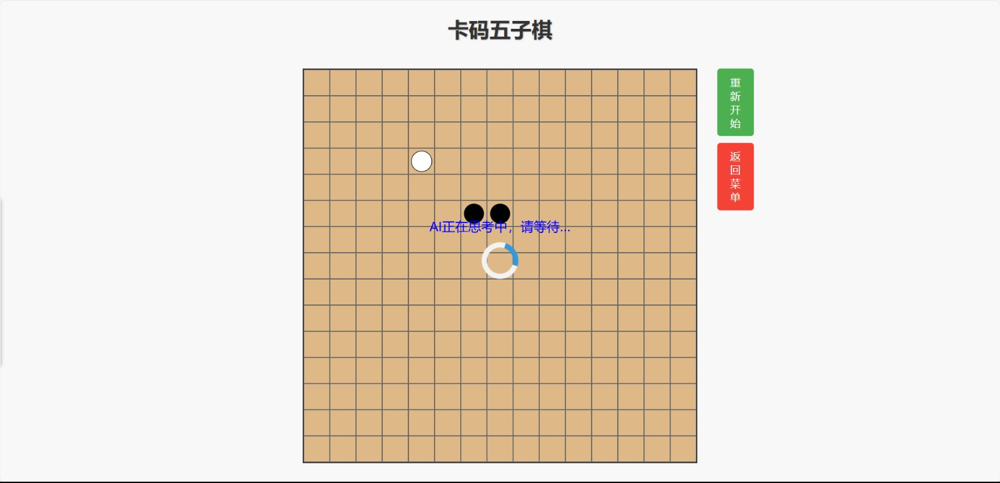

# Kama-HTTPServer
【代码随想录知识星球】项目分享：Kama-HTTPServer

>⭐️ 本项目为[【代码随想录知识星球】](https://programmercarl.com/other/kstar.html) 教学项目  
>⭐️ 在 [HTTP服务框架文档](https://www.programmercarl.com/other/project_http.html) 里详细讲解：项目前置知识 + 项目细节 + 代码解读 + 项目难点 + 面试题与回答 + 简历写法 + 项目拓展。 全面帮助你用这个项目求职面试！
## 项目介绍
本项目是基于C++实现自定义的 HttpServer 框架，该项目包括 HTTP/HTTPS 支持、动态路由处理、会话管理等功能。并基于该框架开发了一个简易的五子棋在线对战游戏，包含登录注册、菜单选择、人机对战等功能。
### HTTP框架目录结构
```
HttpServer/
├── include/
│   ├── http/
│   │   ├── HttpContext.h
│   │   ├── HttpRequest.h
│   │   ├── HttpResponse.h
│   │   └── HttpServer.h
│   ├── router/
│   │   ├── Router.h
│   │   └── RouterHandler.h
│   ├── middleware/
|   |   ├── MiddlewareChain.h
|   |   ├── Middleware.h
|   |   └── cors/
|   |       ├── CorsConfig.h
|   |       └── CorsMiddleware.h
│   ├── session/                
│   │   ├── Session.h
│   │   ├── SessionManager.h
│   │   └── SessionStorage.h
│   ├── ssl/
│   │   ├── SslContext.h
│   │   ├── SslConfig.h
│   │   ├── SslConnection.h
│   │   └── SslTypes.h
│   └── utils/
│       ├── FileUtil.h
│       ├── JsonUtil.h
│       ├── MysqlUtil.h
│       └── db/
│           ├── DbConnection.h
│           ├── DbConnectionPool.h
│           └── DbException.h
├── src/
│   ├── http/
│   │   ├── HttpContext.cpp
│   │   ├── HttpRequest.cpp
│   │   ├── HttpResponse.cpp
│   │   └── HttpServer.cpp
│   ├── router/
│   │   └── Router.cpp
│   ├── middleware/
│   │   ├── MiddlewareChain.cpp
│   │   └── cors/
│   │       └── CorsMiddleware.cpp
│   ├── session/                
│   │   ├── Session.cpp
│   │   ├── SessionManager.cpp
│   │   └── SessionStorage.cpp
│   ├── ssl/
│   │   ├── SslContext.cpp
│   │   ├── SslConfig.cpp
│   │   └── SslConnection.cpp
│   └── utils/
│       ├── FileUtil.cpp
│       └── db/
│           ├── DbConnection.cpp
│           └── DbConnectionPool.cpp
└── tests/
    └── HttpServerTest.cpp
```
### 整体框架模块
- **网络模块**：基于Muduo网络库实现，Muduo网络库提供了基于Reactor模式的高性能网络编程框架，支持多线程和事件驱动的I/O多路复用，简化了C++网络应用的开发。
- **HTTP模块**：用于处理HTTP请求和响应，包括请求的解析、响应的生成和发送。
- **路由模块**：用于管理HTTP请求的路由，根据请求路径和方法将其路由到适当的处理器。支持动态路由和静态路由。
- **中间件模块**：处理 HTTP 请求和响应的函数或组件，它在客户端请求到达服务器处理逻辑之前、或者服务器响应返回客户端之前执行
- **会话管理模块**：基于Session实现，Session是一种用于管理用户会话状态的技术，它可以在多个请求之间保持用户状态的一致性。
- **数据库模块**：数据库连接池通过复用数据库连接来提高应用程序的性能和资源利用效率，减少连接创建和销毁的开销。
- **SSL模块**：用于处理HTTPS请求和响应，包括请求的解析、响应的生成和发送。

## 项目环境
### 环境依赖
- 操作系统(虚拟机或云服务器均可)：Ubuntu 22.04.5
- 数据库：mysql 5.7.29
- boost_1_69_0
- muduo网络库
- nlohmann/json
- openssl
- libmysqlcppconn-dev

### 配置环境
>基础的编译环境配置，可通过linux命令安装，在需要时自行上网搜索相应命令即可。
#### 编译器相关
```sh
sudo apt install g++ cmake make
```  
#### boost库和muduo网络库的安装教程链接：  
boost库：https://blog.csdn.net/QIANGWEIYUAN/article/details/88792874  
muduo库：https://blog.csdn.net/QIANGWEIYUAN/article/details/89023980  
#### 其他第三方库依赖
```
sudo apt upgrade
sudo apt install nlohmann-json3-dev
sudo apt install libmysqlcppconn-dev
sudo apt install libssl-dev
```

## 编译
第一步：在项目根目录下创建build目录，并进入该目录
```
mkdir build
cd build
```
第二步：执行cmake命令
```
cmake ..
```
第三步：编译生成可执行文件
```
make
```  
删除编译生成的可执行文件
```
make clean
```  
## 运行
> 默认运行在80端口，可以通过追加上 -p 端口号 来指定端口
```
sudo ./simple_server
```  

## 运行结果
> 程序运行起来后，到浏览器访问自己对应的 ip:端口号  

登录界面  

菜单界面  
> 匹配玩家和退出游戏待开发中。。。 </br>


对战AI  
> 人机对战目前只是用于demo测试，AI很弱智，待完善。。。  

 

## 总结
- HttpServer是一个基于C++的高性能HTTP服务器框架，旨在简化Web应用的开发与部署。
- 通过结合Reactor模型、OpenSSL和多线程技术，HttpServer提供了高效的请求处理、安全通信和并发支持。
- 该框架支持动态路由、中间件和会话管理，允许开发者专注于业务逻辑的实现。
- 项目的设计考虑了性能和扩展性，适合在现代Web服务中使用。
- 未来将继续完善，欢迎更多开发者参与学习与贡献。


